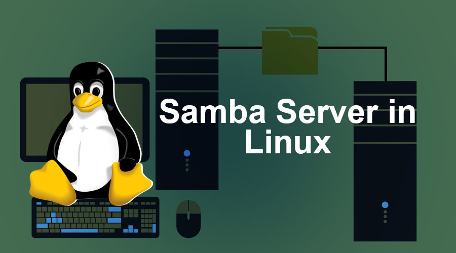

# Configuration Guide



Now that Samba is installed, let's configure it to create network shares.

## Step 1: Edit Samba Configuration File

The main configuration file for Samba is `/etc/samba/smb.conf`. Open this file in a text editor using the following command:

```bash
sudo nano /etc/samba/smb.conf
```

This command opens the configuration file in the Nano text editor with superuser privileges, allowing you to make changes to the Samba configuration.

## Step 2: Configure Shares

Within the configuration file, you'll define shares by adding sections similar to the following:

```ini
[share_name]
   path = /path/to/shared/folder
   browsable = yes
   guest ok = yes
   read only = no
```

- **`[share_name]`:** Replace `share_name` with a unique name for your share. This name will be used to identify the share when accessing it from other devices on the network.


- **`path`:** Specify the full path to the folder you want to share. For example, `/srv/samba/share`.

- **`browsable`:** Set this parameter to `yes` to allow users to browse the shared folder when accessing the Samba server. If set to `no`, the share will be hidden from browsing.

- **`guest ok`:** This parameter determines whether guest users are allowed to access the share without providing a username and password. Set it to `yes` if you want to allow guest access.

- **`read only`:** If set to `yes`, users will only have read permissions for files within the shared folder. Set it to `no` to allow users to create, modify, and delete files within the share.

Adjust these parameters according to your specific requirements and security considerations. Once you've defined your shares, save the configuration file and proceed to the next step.

## Step 3: Save and Close the Configuration File

After making changes to the Samba configuration file, ensure to save your modifications and then close the editor.

1. **Exit Nano:** To exit the Nano text editor, press `Ctrl + X`.

2. **Save Changes:** Nano will prompt you to save your changes. Press `Y` to confirm.

3. **Confirm Filename:** Nano will then prompt you to confirm the filename. Press `Enter` to save the changes to the same file.

Ensure that you save any changes you've made before exiting the editor. Once you've saved and closed the file, you're ready to proceed to the next step.

## Step 4: Restart Samba Service

To apply the changes made to the Samba configuration file, you'll need to restart the Samba service.

1. **Restart Samba:** Run the following command in your terminal to restart the Samba service:

   ```bash
   sudo systemctl restart smbd
   ```
   This command stops and then starts the Samba service, allowing the changes to take effect.

2. **Verify Samba Service Status:** After restarting the Samba service, you can verify its status to ensure that it's running without any errors. Use the following command:
   
   ```bash
   sudo systemctl status smbd
   ```
   This command displays the current status of the Samba service, indicating whether it's active (running) or inactive (stopped).


Once you've restarted the Samba service and verified its status, the changes made to the Samba configuration file should be applied. You can now proceed to access your configured shares from other devices on the network.


